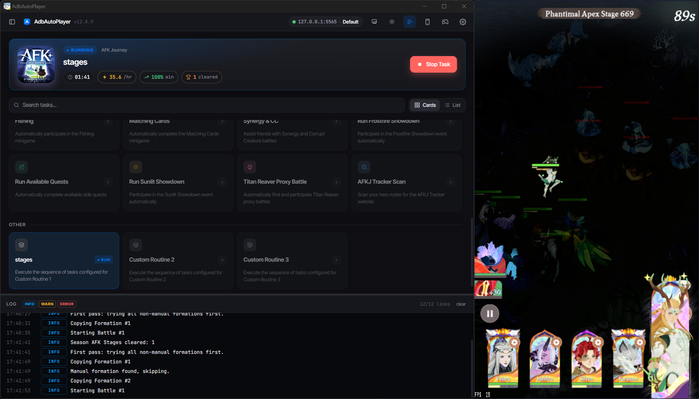
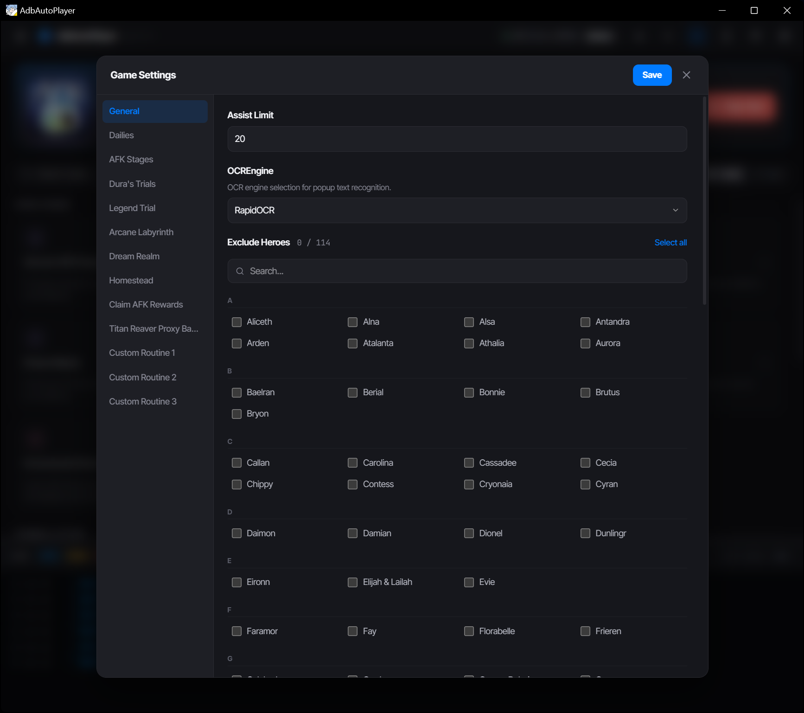
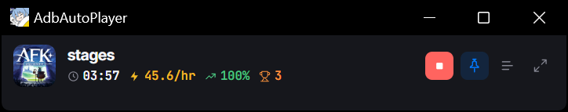

# AdbAutoPlayer
  

## [Click Here to Access the Full Documentation and Usage Details](https://AdbAutoPlayer.github.io/AdbAutoPlayer/)

---

> **This is a personal fork** with UI changes and refactoring not in the upstream release. See below for what's changed.

## What's Different in This Fork

### UI Changes

Updated task grid, run stats, log filtering and resizing, cleaner styling, and a redesigned settings panel.

### Mini Mode

A compact Spotify-style mini player that shows the active task, live stats (time, speed, success rate, trophies), and playback controls. Supports pin-on-top so it stays visible while you use other apps.

---

# Development

## [Click Here for Documentation](https://adbautoplayer.github.io/AdbAutoPlayer/development/dev-and-build.html)

---

# Contact

## AFK Journey
[Discord: Yaphalla](https://discord.gg/yaphalla)  
[Channel: adb-auto-player](https://discord.com/channels/1332082220013322240/1338732933057347655)
